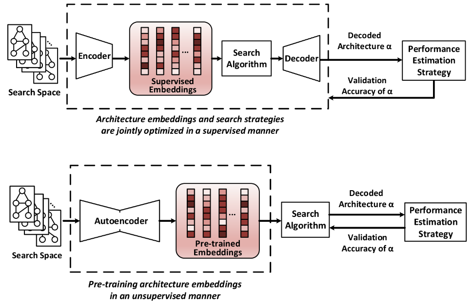

# Does Unsupervised Architecture Representation Learning Help Neural Architecture Search?
Code for paper:
> [Does Unsupervised Architecture Representation Learning Help Neural Architecture Search?](https://arxiv.org/abs/2006.06936)\
> Shen Yan, Yu Zheng, Wei Ao, Xiao Zeng, Mi Zhang.\
> _NeurIPS 2020_.

<p align="center">
   <br />
  <b> Top: </b> The supervision signal for representation learning comes from the accuracies of architectures selected by the search strategies. <b> Bottom (ours): </b> Disentangling architecture representation learning and architecture search through unsupervised pre-training. 
</p>

The repository is built upon [pytorch_geometric](https://github.com/rusty1s/pytorch_geometric), [pybnn](https://github.com/automl/pybnn), [nas_benchmarks](https://github.com/automl/nas_benchmarks), [bananas](https://github.com/naszilla/bananas). 

## 1. Requirements
- NVIDIA GPU, Linux, Python3
```bash
pip install -r requirements.txt
```

## 2. Experiments on NAS-Bench-101 
### Dataset preparation on NAS-Bench-101

Install [nasbench](https://github.com/google-research/nasbench) and download [nasbench_only108.tfrecord](https://storage.googleapis.com/nasbench/nasbench_only108.tfrecord) under `./data` folder.

```bash
python preprocessing/gen_json.py
```

Data will be saved in `./data/data.json`.

### Pretraining
```bash
bash models/pretraining_nasbench101.sh
```

The pretrained model will be saved in `./pretrained/dim-16/`.

### arch2vec extraction 
```bash
bash run_scripts/extract_arch2vec.sh
```

The extracted arch2vec will be saved in `./pretrained/dim-16/`.

Alternatively, you can download the pretrained [arch2vec](https://drive.google.com/file/d/16GnqqrN46PJWl8QnES83WY3W58NUhgCr/view?usp=sharing) on NAS-Bench-101.


### Run experiments of RL search on NAS-Bench-101 
```bash
bash run_scripts/run_reinforce_supervised.sh 
bash run_scripts/run_reinforce_arch2vec.sh 
```

Search results will be saved in `./saved_logs/rl/dim16`

Generate json file: 
```bash 
python plot_scripts/plot_reinforce_search_arch2vec.py 
```


### Run experiments of BO search on NAS-Bench-101
```bash
bash run_scripts/run_dngo_supervised.sh 
bash run_scripts/run_dngo_arch2vec.sh 
```

Search results will be saved in `./saved_logs/bo/dim16`.

Generate json file: 
```bash 
python plot_scripts/plot_dngo_search_arch2vec.py
```

### Plot NAS comparison curve on NAS-Bench-101:
```bash
python plot_scipts/plot_nasbench101_comparison.py
```

### Plot CDF comparison curve on NAS-Bench-101:
Download the search results from [search_logs](https://drive.google.com/drive/u/1/folders/1FKZghhBX0-gVNcQpzYjMShOH7mdkfwC1).
```bash 
python plot_scripts/plot_cdf.py
```


## 3. Experiments on NAS-Bench-201

### Dataset preparation
Download the [NAS-Bench-201-v1_0-e61699.pth](https://drive.google.com/file/d/1SKW0Cu0u8-gb18zDpaAGi0f74UdXeGKs/view) under `./data` folder. 
```bash
python preprocessing/nasbench201_json.py
```
Data corresponding to the three datasets in NAS-Bench-201 will be saved in folder `./data/` as `cifar10_valid_converged.json`, `cifar100.json`, `ImageNet16_120.json`.

### Pretraining
```bash
bash models/pretraining_nasbench201.sh
```
The pretrained model will be saved in `./pretrained/dim-16/`.

Note that the pretrained model is shared across the 3 datasets in NAS-Bench-201.

### arch2vec extraction 
```bash
bash run_scripts/extract_arch2vec_nasbench201.sh
```
The extracted arch2vec will be saved in `./pretrained/dim-16/` as `cifar10_valid_converged-arch2vec.pt`, `cifar100-arch2vec.pt` and `ImageNet16_120-arch2vec.pt`.

Alternatively, you can download the pretrained [arch2vec](https://drive.google.com/drive/u/1/folders/16AIs4GfGNgeaHriTAICLCxIBdYE223id) on NAS-Bench-201.

### Run experiments of RL search on NAS-Bench-201
```bash
CIFAR-10: ./run_scripts/run_reinforce_arch2vec_nasbench201_cifar10_valid.sh
CIFAR-100: ./run_scripts/run_reinforce_arch2vec_nasbench201_cifar100.sh
ImageNet-16-120: ./run_scripts/run_reinforce_arch2vec_nasbench201_ImageNet.sh
```


### Run experiments of BO search on NAS-Bench-201
```bash
CIFAR-10: ./run_scripts/run_bo_arch2vec_nasbench201_cifar10_valid.sh
CIFAR-100: ./run_scripts/run_bo_arch2vec_nasbench201_cifar100.sh
ImageNet-16-120: ./run_scripts/run_bo_arch2vec_nasbench201_ImageNet.sh
```


### Summarize search result on NAS-Bench-201
```bash
python ./plot_scripts/summarize_nasbench201.py
```
The corresponding table will be printed to the console.


## 4. Experiments on DARTS Search Space
CIFAR-10 can be automatically downloaded by torchvision, ImageNet needs to be manually downloaded (preferably to a SSD) from http://image-net.org/download.

### Random sampling 600,000 isomorphic graphs in DARTS space
```bash
python preprocessing/gen_isomorphism_graphs.py
```
Data will be saved in `./data/data_darts_counter600000.json`.

Alternatively, you can download the extracted [data_darts_counter600000.json](https://drive.google.com/file/d/1xboQV_NtsSDyOPM4H7RxtDNL-2WXo3Wr/view?usp=sharing).

### Pretraining
```bash
bash models/pretraining_darts.sh
```
The pretrained model is saved in `./pretrained/dim-16/`.

### arch2vec extraction 
```bash
bash run_scripts/extract_arch2vec_darts.sh
```
The extracted arch2vec will be saved in `./pretrained/dim-16/arch2vec-darts.pt`.

Alternatively, you can download the pretrained [arch2vec](https://drive.google.com/file/d/1bDZCD-XDzded6SRjDUpRV6xTINpwTNcm/view?usp=sharing) on DARTS search space.

### Run experiments of RL search on DARTS search space
```bash
bash run_scripts/run_reinforce_arch2vec_darts.sh
```
logs will be saved in `./darts-rl/`.

Final search result will be saved in `./saved_logs/rl/dim16`.

### Run experiments of BO search on DARTS search space
```bash
bash run_scripts/run_bo_arch2vec_darts.sh
```
logs will be saved in `./darts-bo/` .

Final search result will be saved in `./saved_logs/bo/dim16`.

### Evaluate the learned cell on DARTS Search Space on CIFAR-10
```bash
python darts/cnn/train.py --auxiliary --cutout --arch arch2vec_rl --seed 1
python darts/cnn/train.py --auxiliary --cutout --arch arch2vec_bo --seed 1
```
- Expected results (RL): 2.60\% test error with 3.3M model params.
- Expected results (BO): 2.48\% test error with 3.6M model params.


### Transfer learning on ImageNet
```bash
python darts/cnn/train_imagenet.py  --arch arch2vec_rl --seed 1 
python darts/cnn/train_imagenet.py  --arch arch2vec_bo --seed 1
```
- Expected results (RL): 25.8\% test error with 4.8M model params and 533M mult-adds.
- Expected results (RL): 25.5\% test error with 5.2M model params and 580M mult-adds.


### Visualize the learned cell
```bash
python darts/cnn/visualize.py arch2vec_rl
python darts/cnn/visualize.py arch2vec_bo
```

## 5. Analyzing the results 
### Visualize a sequence of decoded cells from the latent space
Download pretrained supervised embeddings of [nasbench101](https://drive.google.com/file/d/19-1gpMdXftXoH7G5929peoOnS1xKf5wN/view?usp=sharing) and [nasbench201](https://drive.google.com/file/d/1_Pw8MDp6ZrlI6EJ0kS3MVEz3HOSJMnIV/view?usp=sharing).
```bash
bash plot_scripts/drawfig5-nas101.sh # visualization on nasbench-101
bash plot_scripts/drawfig5-nas201.sh # visualization on nasbench-201
bash plot_scripts/drawfig5-darts.sh  # visualization on darts
```
The plots will be saved in `./graphvisualization`.

### Plot distribution of L2 distance by edit distance
Install  [nas_benchmarks](https://github.com/automl/nas_benchmarks) and download [nasbench_full.tfrecord](https://storage.googleapis.com/nasbench/nasbench_full.tfrecord) under the same directory.
```bash
python plot_scripts/distance_comparison_fig3.py
```

### Latent space 2D visualization
```bash
bash plot_scripts/drawfig4.sh
```
the plots will be saved in `./density`.

### Predictive performance comparison
Download [predicted_accuracy](https://drive.google.com/drive/u/1/folders/1mNlg5s3FQ8PEcgTDSnAuM6qa8ECDTzhh) under `saved_logs/`.
```bash
python plot_scripts/pearson_plot_fig2.py
```


# Citation
If you find this useful for your work, please consider citing:
```
@InProceedings{yan2020arch,
  title = {Does Unsupervised Architecture Representation Learning Help Neural Architecture Search?},
  author = {Yan, Shen and Zheng, Yu and Ao, Wei and Zeng, Xiao and Zhang, Mi},
  booktitle = {NeurIPS},
  year = {2020}
}
```


